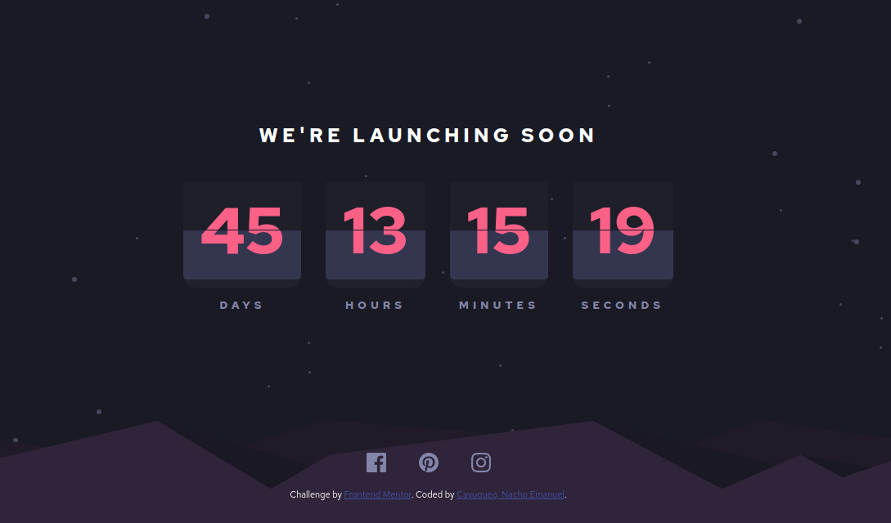
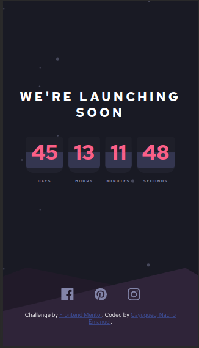

# Frontend Mentor - Launch countdown timer solution

This is a solution to the [Launch countdown timer challenge on Frontend Mentor](https://www.frontendmentor.io/challenges/launch-countdown-timer-N0XkGfyz-). Frontend Mentor challenges help you improve your coding skills by building realistic projects.

## Table of contents

- [Overview](#overview)
  - [The challenge](#the-challenge)
  - [Screenshot](#screenshot)
  - [Links](#links)
- [My process](#my-process)
  - [Built with](#built-with)
  - [What I learned](#what-i-learned)
- [Author](#author)

## Overview

### The challenge

Users should be able to:

- See hover states for all interactive elements on the page
- See a live countdown timer that ticks down every second. Start the count by making a difference between the current date and January 1 of the following year.

- **Bonus**: When a number is changed, the card is flipped from the middle

### Screenshot

|                   Desktop                    |                   Mobile                    |
| :------------------------------------------: | :-----------------------------------------: |
|  |  |

### Links

- Solution URL: [GitHub](https://github.com/NachoCayuqueo/Countdown-Timer)
- Live Site URL: [Count Down](https://yearly-countdown-timer.vercel.app/)

## My process

### Built with

- Semantic HTML5 markup
- CSS custom properties
- Flexbox
- JavaScript

### What I learned

In this project I learned to use animations to generate the effect of flipping the card when it changes number.

## Author

- Frontend Mentor - [@NachoEC](https://www.frontendmentor.io/profile/NachoCayuqueo)
